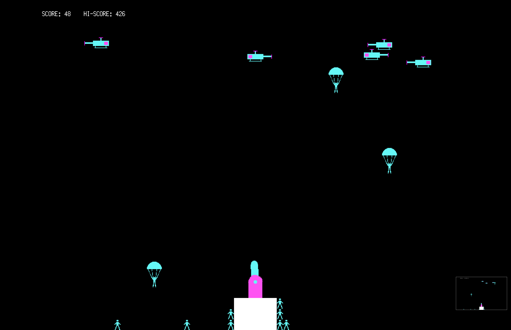

[](https://go.dev)
[](https://github.com/ystepanoff/ParaGopher/forks)
[](https://github.com/ystepanoff/ParaGopher/issues)
[](https://github.com/ystepanoff/ParaGopher/blob/main/LICENSE)
[](https://ebitengine.org/)

# ParaGopher



**ParaGopher** is a retro-style arcade game written in Go using [Ebitengine](https://ebitengine.org). 
Inspired by the classic [Paratrooper](https://en.wikipedia.org/wiki/Paratrooper_(video_game)) IBM PC game (1982),
the game allows the player to control a turret that must defend the base against incoming paratroopers. Tilt the turret,
shoot down threats, and prevent paratroopers from reaching your base!

## Running the game
Ensure you have Go installed. You can download it from [https://go.dev/dl/](https://go.dev/dl/). 
```
git clone https://github.com/ystepanoff/ParaGopher
cd ParaGopher
go run cmd/game.go
```

Alternatively, visit the [Releases](https://github.com/ystepanoff/ParaGopher/releases) section, which contains pre-built binaries
for some platforms.

## Controls
* Left Arrow (`←`): Rotate turret barrel to the left.
* Right Arrow (`→`): Rotate turret barrel to the right.
* Space: Shoot bullets from the turret.
* R: Open the resolution menu.
* Escape (`Esc`): Quit the game.

### Resolution menu
* Up/Down Arrows: Navigate resolution options.
* Enter: Apply the selected resolution.
* F: Toggle fullscreen mode.
* Escape (`Esc`) / R: Close the menu.

## Contributions
Contributions are welcome! Whether it is reporting bugs, suggesting features, or submitting pull requests, your help is appreciated.
